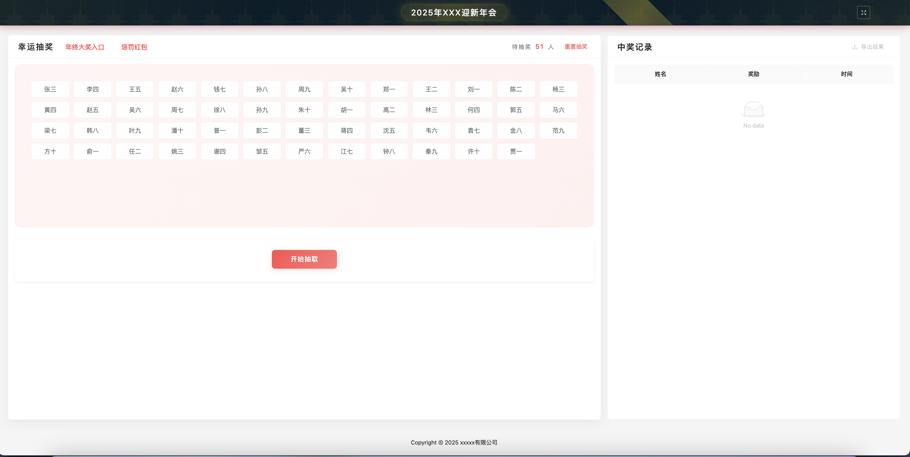
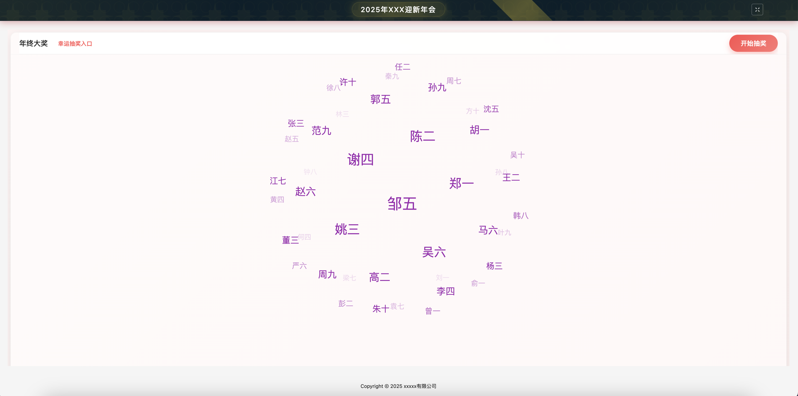
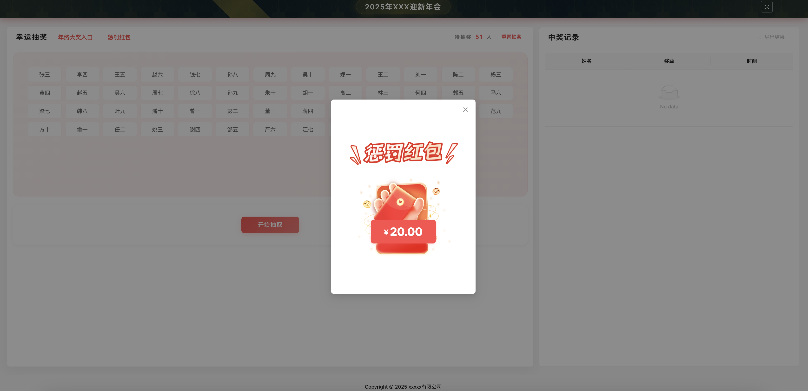

# 年会抽奖系统

[](https://vuejs.org/)
[](https://vitejs.dev/)
[](https://antdv.com)
[](LICENSE)

> 🎯 一个基于 Vue 3 + Ant Design Vue 开发的现代化年会抽奖系统。支持奖品抽取、趣味任务、红包抽取等多种互动形式，界面美观，交互流畅，适合各类企业年会使用。

## 🌟 特色亮点

- 🎲 双模式抽奖：支持常规奖品抽奖和年终特别奖抽奖
- 🎮 趣味任务：随机触发有趣的互动环节
- 🧧 红包抽取：支持定制金额的红包抽取环节
- 💾 数据持久：本地存储抽奖记录，支持导出Excel
- 🎨 精美动画：流畅的抽奖动效和弹窗动画
- 🛠️ 高可配置：灵活的奖品池和人员配置

## 📸 运行截图

### 幸运抽奖模式

- 支持常规奖品抽取
- 支持趣味任务触发
- 支持红包抽取
- 实时展示中奖记录
- 支持导出记录

### 年终大奖模式

- 独立的抽奖入口
- 特殊的抽奖动画
- 专属候选人名单
- 更加庄重的展示效果

### 红包抽取

- 随机金额抽取
- 精美开启动画
- 固定金额配置

## 💡 抽奖模式

系统分为两种核心抽奖模式：

### 1. 幸运抽奖模式
- 面向所有参与者
- 支持多个奖品池
  - 默认奖品池（所有人都可以参与）
  - 特殊奖品池（针对特定人群）
- 支持趣味任务
  - 随机触发小游戏或任务
  - 任务完成后继续抽奖
- 支持红包抽取
  - 固定金额配置
  - 随机抽取展示

### 2. 年终大奖模式
- 独立的抽奖入口
- 专门的候选人名单
- 特殊的抽奖规则
- 庄重的展示效果
- 独特的动画设计

## ✨ 功能特点

- 🎯 多级奖品池配置
  - 支持默认奖品池
  - 支持特殊奖品池（针对特定人群）
  - 支持年终大奖特殊奖池
  - 支持红包金额配置

- 🎮 丰富的抽奖玩法
  - 常规奖品抽奖
  - 趣味任务抽取
  - 红包金额抽取
  - 年终大奖抽取

- 👥 灵活的人员管理
  - 支持分组管理参与人员
  - 防止重复中奖
  - 实时显示待抽奖人数

- 🎨 精美的视觉体验
  - 动态滚动抽奖效果
  - 优雅的弹窗动画
  - 红包开启动效
  - 完全响应式设计

- 📊 完整的数据记录
  - 中奖记录实时更新
  - 支持导出Excel
  - 数据本地持久化

## 🚀 快速开始

### 环境要求

- Node.js >= 14
- Vue 3
- Vite

### 安装

```bash
# 克隆项目
git clone https://github.com/your-username/lucky-draw.git

# 进入项目目录
cd lucky-draw

# 安装依赖
yarn install
```

### 开发

```bash
# 启动开发服务器
yarn dev
```

### 构建

```bash
# 构建生产版本
yarn build
```

## 📖 使用指南

### 配置文件

1. 参与人员配置 (`src/config/participants.js`):
```javascript
export const participants = [
  { id: '101', name: '张三' },
  { id: '102', name: '李四' }
  // ...
]
```

2. 奖池配置 (`src/config/pools.js`):
```javascript
// 默认奖励池
export const defaultRewardPool = {
  id: 1,
  name: '奖励池A',
  items: [
    { id: 'r1', name: '奖品1', count: 2 }
    // ...
  ]
}

// 特殊奖励池
export const specialRewardPools = [
  {
    id: 'special1',
    name: '特殊奖励池1',
    participants: ['张三', '李四'],
    items: [
      { id: 'sr1', name: '特殊奖品1', count: 1 }
    ]
  }
]

// 红包金额配置
export const redPacketAmounts = [
  { id: 'rp1', amount: 10 },
  { id: 'rp2', amount: 20 }
]
```

### 抽奖流程

1. 常规奖品抽奖
   - 点击"开始抽取"按钮选择中奖人
   - 自动或手动停止后展示中奖者
   - 抽取奖品并显示结果

2. 趣味任务
   - 在奖品抽取前可能触发趣味任务
   - 任务完成后继续抽取奖品

3. 红包抽取
   - 点击"抽红包"按钮
   - 随机抽取预设金额
   - 展示红包金额

4. 年终大奖
   - 通过年终大奖入口进入
   - 特殊的抽奖动画和展示效果

## 🛠️ 技术栈

- Vue 3 - 渐进式 JavaScript 框架
- Vite - 下一代前端构建工具
- Ant Design Vue 4.x - UI 组件库
- Pinia - Vue 状态管理库
- Vue Router - Vue 路由管理
- XLSX - Excel 文件处理

## 📝 开发计划

- [ ] 添加更多动画效果
- [ ] 支持自定义主题
- [ ] 添加后台管理系统
- [ ] 支持在线导入人员名单
- [ ] 添加更多趣味玩法

## 🤝 贡献指南

1. Fork 本仓库
2. 创建你的特性分支 (git checkout -b feature/AmazingFeature)
3. 提交你的改动 (git commit -m 'Add some AmazingFeature')
4. 推送到分支 (git push origin feature/AmazingFeature)
5. 打开一个 Pull Request

## 📄 开源协议

本项目基于 MIT 协议开源，详细请参考 [LICENSE](LICENSE) 文件。
